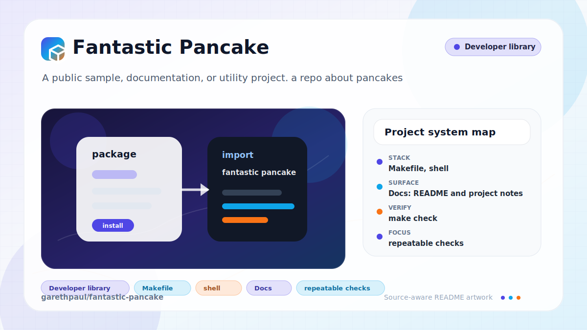

# fantastic-pancake

<!-- README-OVERVIEW-IMAGE -->


## Overview

`garethpaul/fantastic-pancake` is a public sample, documentation, or utility project. a repo about pancakes

This is maintained as a content-only pancake notes repository. It should stay
small until there is a concrete publishing need for a site, app, or data
pipeline.

## Repository Contents

- `SECURITY.md` - security reporting and disclosure guidance
- `CHANGES.md` - concise history of repository maintenance changes
- `Makefile` - local check entry point
- `VISION.md` - project direction and maintenance guardrails
- `docs/readme-overview.svg` - README overview image
- `pancakes.md` - pancake method, tips, troubleshooting, and content outline

Additional scan context:

- Source directories: no top-level source directories detected
- Dependency and build manifests: none detected
- Entry points or build surfaces: none detected
- Test-looking files: `scripts/check-baseline.sh`

## Getting Started

### Prerequisites

- Git

### Setup

```bash
git clone https://github.com/garethpaul/fantastic-pancake.git
cd fantastic-pancake
```

The setup commands above are derived from repository files. Legacy mobile, Python, or JavaScript samples may require older SDKs or package versions than a modern workstation uses by default.

## Running or Using the Project

- Read `pancakes.md`.
- Keep future edits plain Markdown unless a publishing workflow becomes necessary.

## Testing and Verification

Run the content baseline:

```bash
make check
```

The baseline verifies that the repository remains content-only, README/VISION
stay linked to `pancakes.md`, the overview image targets this repo, and the
pancake document keeps real sections instead of placeholder separators. It also
keeps practical troubleshooting notes, keeps food-safety notes tied to an
official FoodSafety.gov source, and enforces a no-scaffold contract so app
manifests, dependency lockfiles, source directories, and generated dependency
directories do not appear without a new plan. Event serving notes must keep
source-backed allergen guidance, separate utensil language, and avoid
unsupported allergen-free claims.

When the required SDK or runtime is unavailable, use static checks and source review first, then verify on a machine that has the matching platform toolchain.

## Configuration and Secrets

- No required secret or credential file was identified in the repository scan. If you add integrations later, keep secrets out of git.

## Security and Privacy Notes

- The scan did not identify production authentication, payment, or secret-management code. Treat future additions in those areas as security-sensitive.
- Food-safety guidance should cite official sources and avoid vague storage or
  serving claims.
- Allergen guidance should stay tied to official sources and should not promise
  allergen-free preparation without controlled ingredients and surfaces.

## Maintenance Notes

- Run `make check` before pushing content or documentation changes.
- Keep the no-scaffold contract in place until there is a concrete publishing
  plan for an app or static site.
- Keep the allergen event-serving notes source-backed when expanding pancake
  bars or community breakfast guidance.
- See `SECURITY.md` for vulnerability reporting and safe research guidance.
- See `VISION.md` for project direction and contribution guardrails.

## Contributing

Keep changes small and tied to the project that is already present in this repository. For code changes, document the toolchain used, avoid committing generated dependency directories or local configuration, and update this README when setup or verification steps change.
